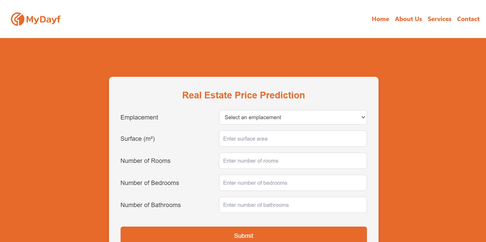
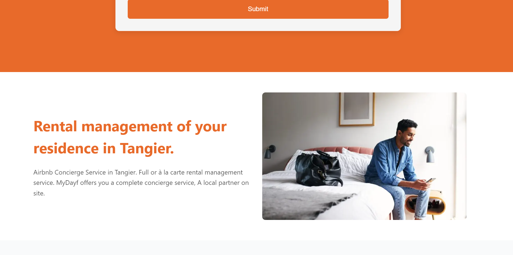
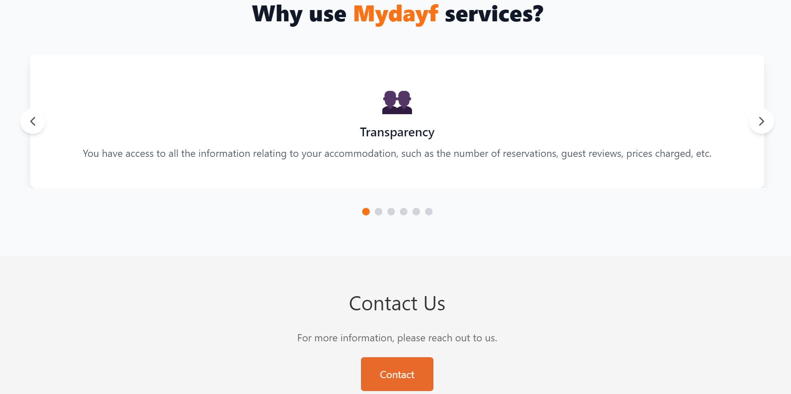
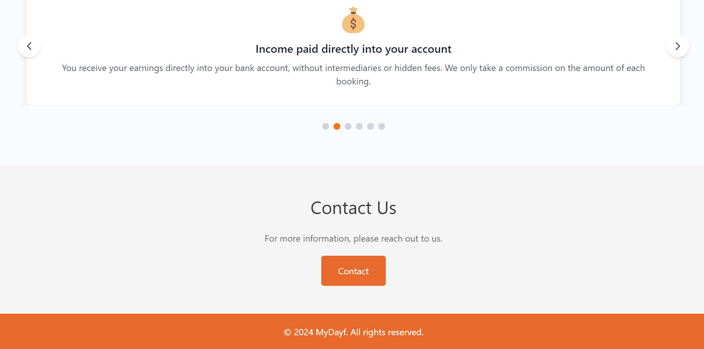
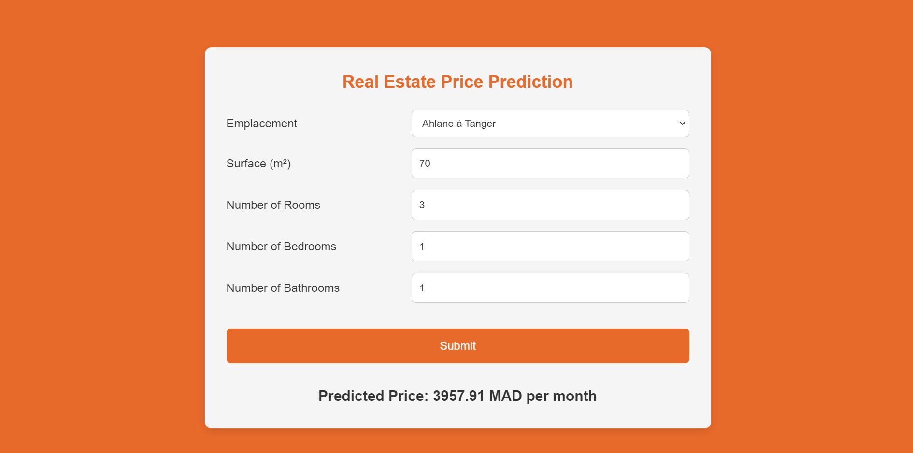

# House-Rent-Prediction
Full-stack application for predicting house rental prices, built with Next.js and FastAPI.

## Scrapping Data
For the rental price prediction project, I utilized web scraping to collect data from the Mubawab website, a real estate platform in Morocco. The data included essential features such as property location, surface area, number of rooms, and listed rental prices.
I used Python libraries like BeautifulSoup and Requests to automate the extraction of this data. After gathering the raw data, I performed cleaning operations to remove unwanted characters (e.g., \n, \t) and standardize the format. The cleaned data was then stored in CSV format and served as the dataset for further preprocessing and model training.

## Preprocessing and Training
Once the raw data was collected, I proceeded with the preprocessing steps. This involved handling missing values, removing duplicates, and encoding categorical features such as property locations. For numerical features like surface area and rental price, I normalized the data to ensure that the model could train efficiently.

For model training, I experimented with several regression algorithms, including Linear Regression, K-Nearest Neighbors (KNN), and Random Forest. After evaluating the performance of these models, I selected Gradient Boosting with polynomial features as the final model due to its superior accuracy in predicting rental prices. The model was trained on the cleaned dataset and optimized for generalization.

## Frontend
The front-end of the rental price prediction project was developed using Next.js, a React framework for building dynamic web applications. The interface allows users to input property details, such as location, surface area, and number of rooms, and instantly receive a predicted rental price.

I focused on creating a user-friendly and responsive design, ensuring the form fields and buttons are clear and easy to interact with. The interface was styled with custom CSS to match the MyDayf platform's color scheme, with a clean and professional layout. Additionally, the front end communicates with the backend API, developed using FastAPI, to send user input and retrieve predictions in real-time.

When the user opens the website see this :

AboutUs Component :

Services Component :

Contact us Component and Navbar :

Prediction :

